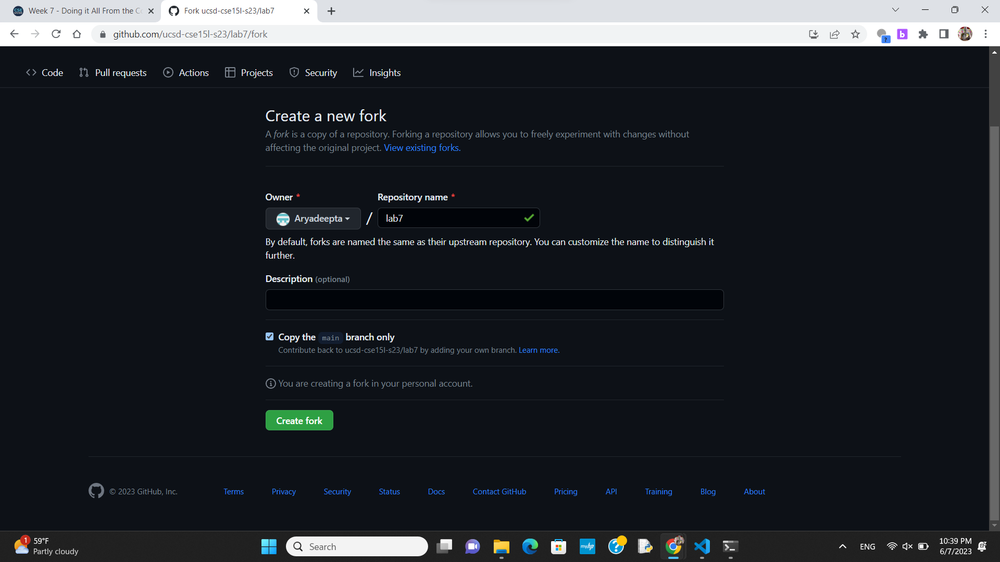
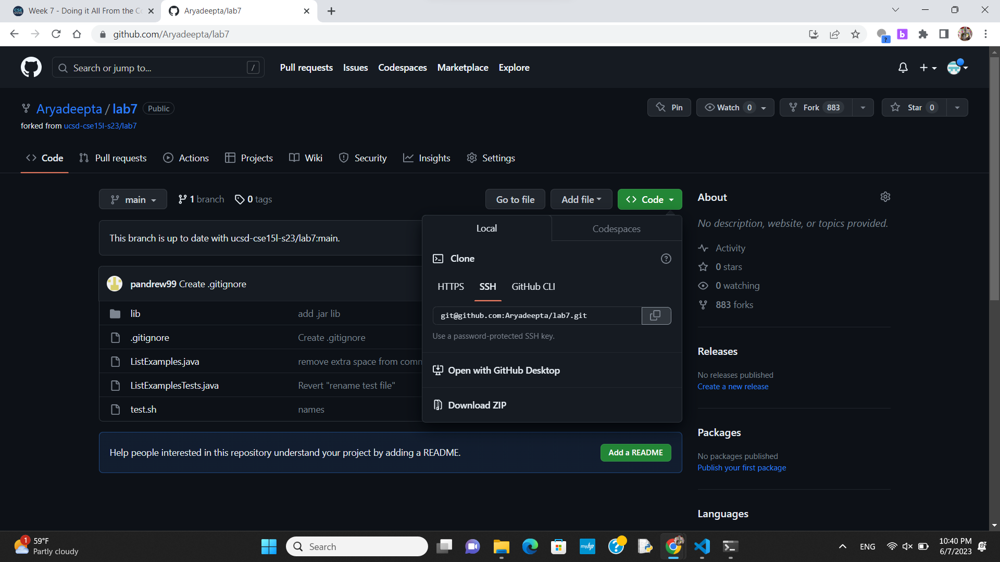
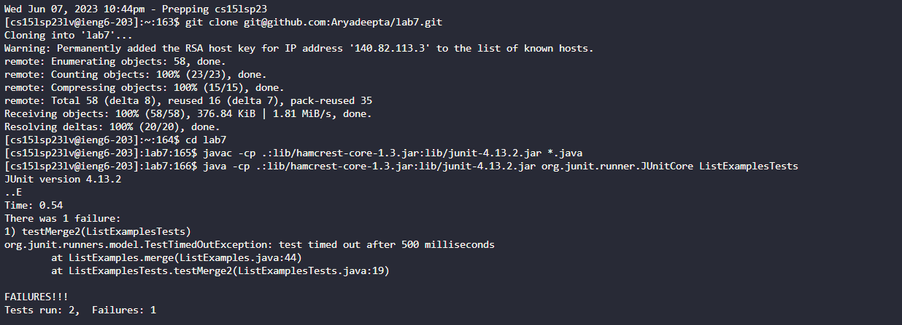
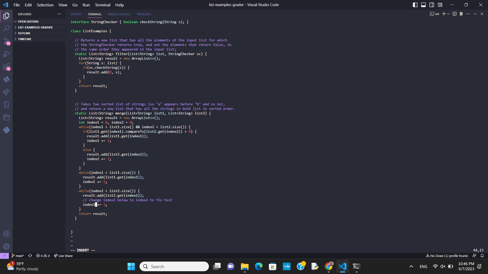
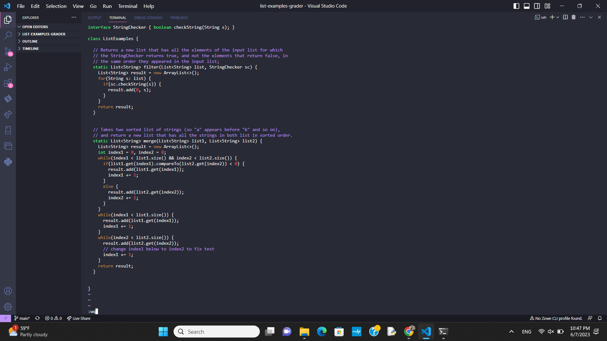
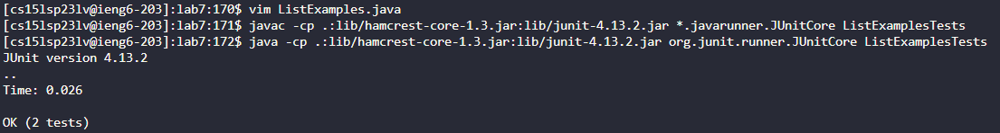
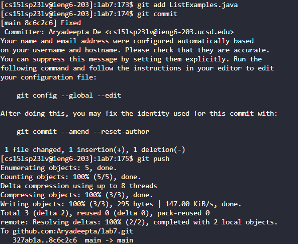
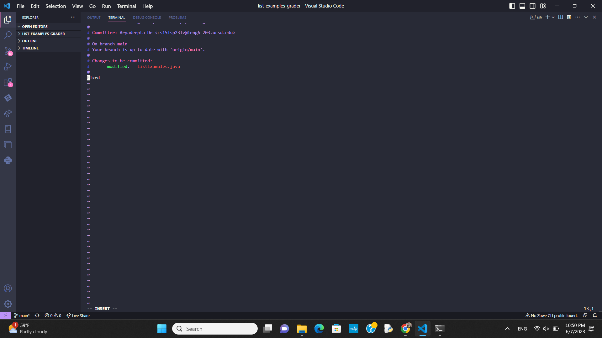

# Fixing ListExamples.java Speedrun
## Github stuff

First, I forked the original

Then, I got the ssh from the fork for later
## Logging in

Since I had preset it, I only had to go up twice:
`<UP><UP><ENTER>`
## Initialize

I then had to clone, go to the new folder, and test it out. I used the keys:
`git clone <RIGHT CLICK><ENTER>cd lab7<ENTER><CTRL+R>javac <ENTER><ENTER><CTRL+R>java <ENTER><ENTER>`
## Vim
First, I had to enter vim, so I typed:
`vim ListExamples.java<ENTER>`

I was put in the perfect position to go up and edit the 1 to a 2, so I typed
`<ESC>kkhxi2<ESC>`

I then needed to save the file:
`:wq<ENTER>`
## Test

Finally, I needed to test it. Since, I had run the tests just before, I typed:
`<UP><UP><UP><ENTER><UP><UP><UP><ENTER>`
## Push

To start the commit, I typed:
`git add ListExamples.java<ENTER>git commit<ENTER>`

This brought me to the commit screen, where I needed to add a comment and save the file through vim. I typed:
`<ESC>jjjjjjjjjaFixed<ESC>:wq<ENTER>`
Finally, I could get back to pushing, which I did by typing:
`git push<ENTER>`
